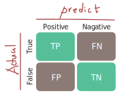

# 1. 분류 모델 성능 지표
- 이진 분류, 다중 클래스 분류에 사용

## 1) Confusion Matrix

|분류|설명|정답|
|---|:---:|---|
| TP | 실제 양성을 양성으로 예측함 | 옳음 |
| FN | 실제 양성을 음성으로 예측함 | 틀림 |
| TN | 실제 음성을 음성으로 예측함 | 옳음 |
| FP | 실제 음성을 양성으로 예측함 | 옳음 |

## 2) 성능 지표
|분류|공식|설명|
|:---:|:---:|:---:|
|정확도(Accuracy)| $\frac{TP + TN}{TP + TN + FP + FN}$ |전체 데이터 중 맞게 예측한 비율|
|정밀도(Precision)| $\frac{TP}{TP + FP}$ |양성이라 예측한 결과 중에서 실제양성이 차지하는 비율|
|재현율(Recall, TPR)| $\frac{TP}{TP + FN}$ |실제양성 중에서 성공적으로 양성으로 예측된 비율|
|위양성률(FPR)| $\frac{FP}{FP + TN}$ |실제음성 중에서 음성예측에 실패한 비율|
|F1-Score|$2 \times \frac{\text{Precision} \times \text{Recall}}{\text{Precision} + \text{Recall}}$| 정밀도와 재현율의 조화평균으로, 두 지표 간 균형을 맞춤|

### ROC-AUC

- 임곗값(threshold)를 조정하면서 FPR(x축)과 TPR(y축)의 변화를 나타내는 그래프
- 왼쪽 위로 곡선이 치우칠수록 좋은 모델(TPR은 높고, FPR은 낮음)
- 45도 대각선은 랜덤 추측(무작위 분류)
- AUC는 ROC 곡선 아래 면적 (0.5: 랜덤분류, 1.0: 완벽한 분류)

# 2. 회귀 모델 성능 지표
- 연속형 데이터 예측에 사용

## 1) 지표 유형
|지표|설명|
|:---:|:---:|
|MAE(Mean Absolute Error)|절대 오차 평균, 오차 크기를 직관적으로 확인|
|MSE(Mean Square Error)|오차의 제곱평균|
|RMSE(Root Mean Squre Error) |실제양성 중에서 성공적으로 양성으로 예측된 비율|
|$R^2$(Coefficient of Determination)|결정계수, 예측 모델이 실제 데이터를 얼마나 잘 설명하는지 나타냄|
- 공식은 아래 참조
 

## 2) RMSE (Root Mean Squre Error) 
  - MSE에 루트를 취해 원래 단위로 변환
  - 제곱근을 통해 실제 값과 같은 단위로 변환
  - 예시: 예측 값이 "온도(°C)"라면,
    - MSE = 25 → 단위는 °C² (해석이 어려움)
    - RMSE = 5 → 단위는 °C (직관적)
R^2 (결정계수, Coefficient of Determination) 예측 모델이 실제 데이터를 얼마나 잘 설명하는지 나타냄

## 3) 지표별 공식

- $정확도(Accuracy) = \frac{TP + TN}{TP + TN + FP + FN}$
- $정밀도(Precision) = \frac{TP}{TP + FP}$
- $재현율(Recall, TPR) = \frac{TP}{TP + FN}$
- $위양성률(FPR) = \frac{FP}{FP + TN}$
- $F1Score = 2 \times \frac{\text{Precision} \times \text{Recall}}{\text{Precision} + \text{Recall}}$
- $MAE = \frac{1}{n} \sum_{i=1}^{n} |y_i - \hat{y}_i|$
- $MSE = \frac{1}{n} \sum_{i=1}^{n} (y_i - \hat{y}_i)^2$
- $RMSE = \sqrt{\frac{1}{n} \sum_{i=1}^{n} (y_i - \hat{y}_i)^2}$

- $R^2 = 1 - \frac{\sum_{i=1}^{n} (y_i - \hat{y}_i)^2}{\sum_{i=1}^{n} (y_i - \bar{y})^2}$